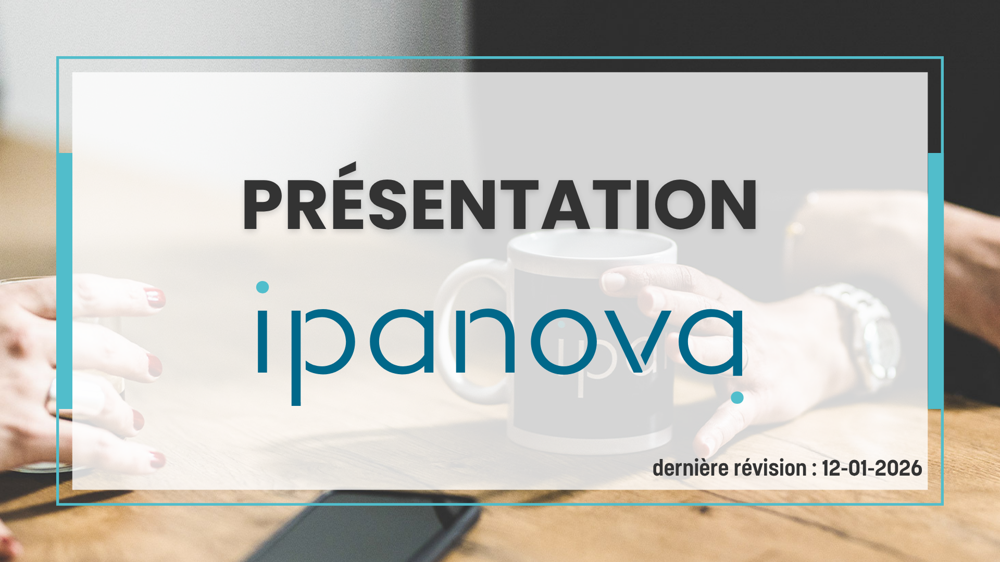
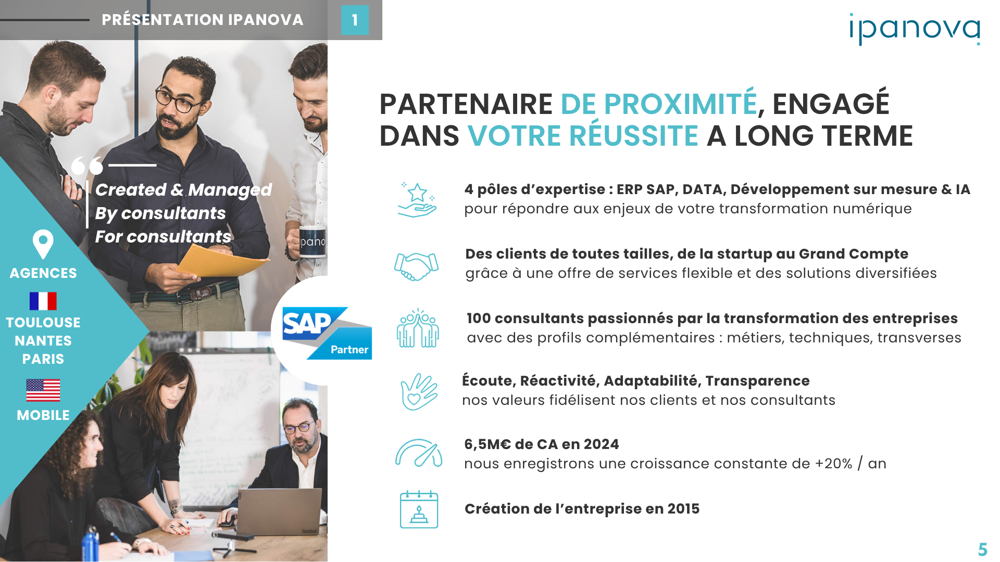
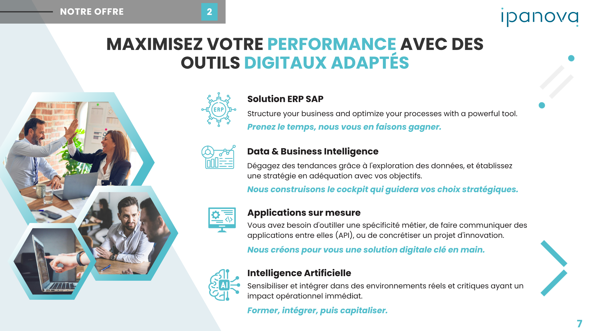
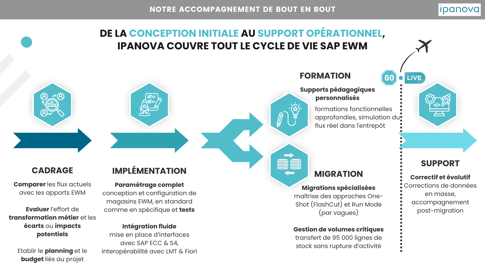
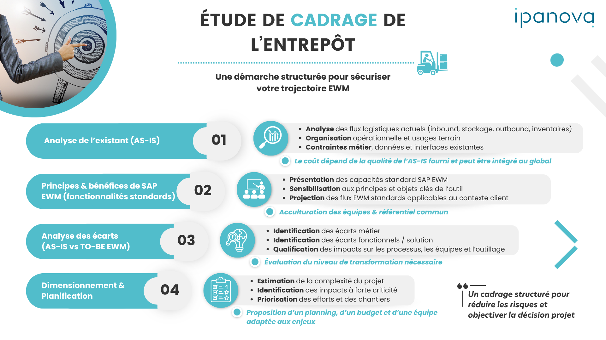
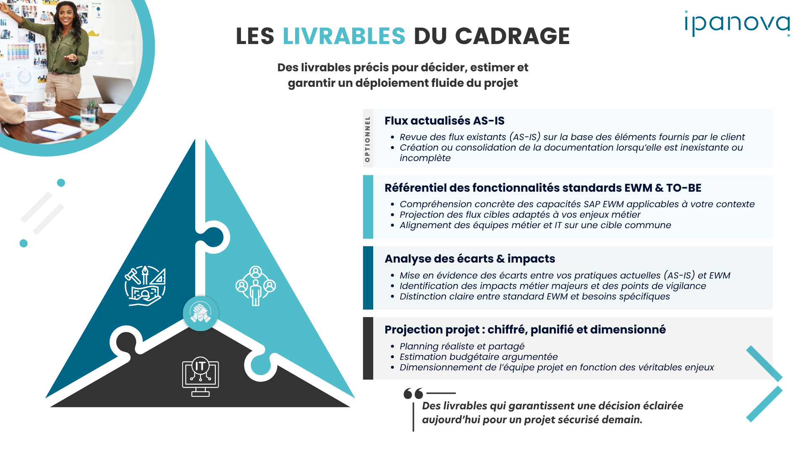

<div align="center">
  
</div>

<br/>

<div align="center">


</div>

<br/>

<div align="center">
<strong>Un système de design complet pour générer des slides Ipanova conformes à la charte,<br/>avec n'importe quel LLM, en une seule injection de fichier.</strong>
</div>

---

## ★ Démarrage rapide

**Une seule règle :** injecte [`DESIGN.md`](DESIGN.md) dans ton LLM. Il contient tout.

```
1. Copie le contenu de DESIGN.md dans le contexte de ton LLM
2. Fournis un brief (modèle dans prompts/generation-brief.md)
3. Demande la génération en python-pptx, HTML, ou tout autre format
```

> Le fichier `DESIGN.md` suit le standard [getdesign.md](https://getdesign.md/) —
> token, règle et rationale dans un seul fichier, lisible par un agent ou par un humain.

---

## Aperçu des slides

<table>
  <tr>
    <td width="33%"><br/><sub><b>Cover</b> — Titre + photo de fond</sub></td>
    <td width="33%"><br/><sub><b>Sommaire</b> — Ghost numbers + sections</sub></td>
    <td width="33%"><br/><sub><b>Section Divider</b> — Transition de section</sub></td>
  </tr>
  <tr>
    <td width="33%"><br/><sub><b>Content Split</b> — Photo + liste icônes</sub></td>
    <td width="33%"><br/><sub><b>Content Icon List</b> — Grille de services</sub></td>
    <td width="33%"><br/><sub><b>Process Timeline</b> — Phases horizontales</sub></td>
  </tr>
  <tr>
    <td width="33%"><br/><sub><b>Numbered Steps</b> — Méthodologie en étapes</sub></td>
    <td width="33%"><br/><sub><b>Deliverables</b> — Livrables + infographie</sub></td>
    <td width="33%"><br/><sub><b>Closing</b> — Slide de clôture + contact</sub></td>
  </tr>
</table>

---

## Palette de couleurs

<table>
  <tr>
    <td align="center" width="16%">
      <br/>
      <b>Primary</b><br/>
      <code>#51bdcb</code><br/>
      <sub>Teal — mots-clés,<br/>icônes, taglines</sub>
    </td>
    <td align="center" width="16%">
      <br/>
      <b>Secondary</b><br/>
      <code>#006688</code><br/>
      <sub>Bleu foncé — logo,<br/>diagonales déco</sub>
    </td>
    <td align="center" width="16%">
      <br/>
      <b>Dark</b><br/>
      <code>#333333</code><br/>
      <sub>Quasi-noir —<br/>tous les textes</sub>
    </td>
    <td align="center" width="16%">
      <br/>
      <b>Light</b><br/>
      <code>#FAFAFA</code><br/>
      <sub>Blanc cassé —<br/>fond de slide</sub>
    </td>
    <td align="center" width="16%">
      <br/>
      <b>Banner</b><br/>
      <code>#555555</code><br/>
      <sub>Gris moyen —<br/>bandeau de section</sub>
    </td>
    <td align="center" width="16%">
      <br/>
      <b>Light Teal</b><br/>
      <code>#B8E8EE</code><br/>
      <sub>Teal pâle —<br/>fonds décoratifs</sub>
    </td>
  </tr>
</table>

---

## Typographie

<div align="center">

**Police unique : [Poppins](https://fonts.google.com/specimen/Poppins) — 5 graisses utilisées**

</div>

| Rôle | Graisse | Taille | Règle |
|---|---|---|---|
| Titre H1 slide | ExtraBold 800 | 36–48pt | UPPERCASE · mot-clé en `#51bdcb` |
| Titre section-divider | Black 900 | 56–72pt | UPPERCASE · bicolore |
| Titre cover | Black 900 | 72–96pt | UPPERCASE · `#333333` |
| Ghost number | Black 900 | 200–280pt | `#51bdcb` à 8–12% opacité |
| Label icon-block | Bold 700 | 16–18pt | Sentence case · `#333333` |
| Corps de texte | Regular 400 | 13–15pt | 3 lignes max |
| Tagline italique | Bold Italic 700 | 13–15pt | `#51bdcb` · ≤ 8 mots |
| Bandeau section | Bold 700 | 12–14pt | UPPERCASE · letter-spacing 3px |

> **Règle absolue des titres :** `MOT CLÉ` en teal · reste en dark · toujours UPPERCASE · jamais d'autre combinaison.

---

## Les 10 layouts

<table>
  <tr>
    <th width="20%">Layout</th>
    <th width="35%">Usage</th>
    <th width="45%">Structure</th>
  </tr>
  <tr>
    <td><code>cover</code></td>
    <td>Première slide — titre + date</td>
    <td>Photo plein fond + cadre centré + logo</td>
  </tr>
  <tr>
    <td><code>sommaire</code></td>
    <td>Plan du deck</td>
    <td>Ghost numbers 01–05 en grille + labels sections</td>
  </tr>
  <tr>
    <td><code>section-divider</code></td>
    <td>Transition entre sections</td>
    <td>Grand numéro + titre gauche · photos hexagonales droite</td>
  </tr>
  <tr>
    <td><code>content-split</code></td>
    <td>Photo + liste de points</td>
    <td>35% photo gauche / 65% icon-blocks droite</td>
  </tr>
  <tr>
    <td><code>content-icon-list</code></td>
    <td>Présentation de services</td>
    <td>Grille 2×2 icon-blocks avec taglines teal</td>
  </tr>
  <tr>
    <td><code>content-map</code></td>
    <td>Présence géographique</td>
    <td>Carte pleine largeur + bloc expertise bas</td>
  </tr>
  <tr>
    <td><code>process-timeline</code></td>
    <td>Phases d'un projet</td>
    <td>4 colonnes + chevrons teal + badge GO LIVE</td>
  </tr>
  <tr>
    <td><code>numbered-steps</code></td>
    <td>Méthodologie en étapes</td>
    <td>Grille 2×2 · ghost numbers teal · info boxes</td>
  </tr>
  <tr>
    <td><code>deliverables</code></td>
    <td>Livrables d'une mission</td>
    <td>Infographie triangle gauche + liste bordée droite</td>
  </tr>
  <tr>
    <td><code>closing</code></td>
    <td>Slide de clôture + contact</td>
    <td>50/50 · panneau dark gauche · photo + contact droite</td>
  </tr>
</table>

---

## Composants clés

<table>
  <tr>
    <td align="center" width="25%">
      <br/>⬡<br/><br/>
      <b>Hexagon Icon Frame</b><br/>
      <sub>Fond <code>#51bdcb</code> · icône outline blanche<br/>64pt standard · jamais d'icône nue</sub>
    </td>
    <td align="center" width="25%">
      <br/>▬<br/><br/>
      <b>Section Banner</b><br/>
      <sub>Fond <code>#555555</code> · 36pt hauteur<br/>Présent sur TOUTES les slides de contenu</sub>
    </td>
    <td align="center" width="25%">
      <br/><b>01</b><br/><br/>
      <b>Ghost Number</b><br/>
      <sub>Poppins Black 900 · 200–280pt<br/><code>#51bdcb</code> à 8–12% · derrière le contenu</sub>
    </td>
    <td align="center" width="25%">
      <br/><i>tagline ›</i><br/><br/>
      <b>Tagline Italique</b><br/>
      <sub>Bold Italic · <code>#51bdcb</code> · ≤ 8 mots<br/>1 par bloc de service · la promesse client</sub>
    </td>
  </tr>
</table>

---

## Assets disponibles

<details>
<summary><b>🎨 22 icônes teal outline</b> — cliquer pour voir</summary>

<br/>

| Catégorie | Icônes |
|---|---|
| Personnes & Organisation | `user` · `team` · `org-chart` · `team-cycle` · `team-victory` · `graduate` |
| Valeurs & Relation | `hand-heart` · `star-hand` · `high-five` · `chat` · `hands` |
| Technique & Digital | `gear-check` · `speedometer` · `puzzle` · `iot` · `innovation-cycle` |
| Logistique & Métier | `warehouse` · `clock` · `globe` |
| Recherche & Objectifs | `eye` · `search` · `target` |

Toutes dans `images/icons/` — format PNG, style line-art outline teal `#51bdcb`.  
→ Voir [`images/INDEX.md`](images/INDEX.md) pour les contextes d'usage.

</details>

<details>
<summary><b>📸 18 photos équipe authentiques</b> — cliquer pour voir</summary>

<br/>

| Sujet | Fichier | Usage recommandé |
|---|---|---|
| Portrait Arnaud Goulley (DG) | `portrait-arnaud-neon.jpg` | Closing, présentation dirigeant |
| Réunion 3 personnes, laptop | `team-meeting-3people-laptop.jpg` | Content-split gauche |
| Duo conversation bureau | `team-duo-conversation-office.jpg` | Content-split, relation client |
| Duo high-five bureau | `team-duo-highfive-office.jpg` | Closing, résultats |
| Femme devant code VS Code | `developer-woman-coding-screen.jpg` | Section développement / IA |
| Mission Airbus Bengaluru | `client-mission-airbus-india-team.jpg` | Section références clients |
| … + 12 autres | | → [`images/team-photos/INDEX.md`](images/team-photos/INDEX.md) |

</details>

<details>
<summary><b>🔷 3 éléments graphiques décoratifs</b> — cliquer pour voir</summary>

<br/>

| Fichier | Description |
|---|---|
| `bg-pattern-full.png` | Fond pleine slide — rayures grises + dots teal |
| `motif-corner-dots-stripes.png` | Motif de coin — 2 barres + 2 dots teal |
| `motif-chevron.png` | Chevron teal `>` — accent directionnel |

</details>

---

## Structure du repo

```
ipanova-design-system/
│
├── DESIGN.md                    ★ Point d'entrée — système complet en un fichier
│
├── tokens/                      Design tokens de référence
│   ├── colors.json              Palette + rôles sémantiques
│   ├── typography.json          Échelle typographique complète
│   └── spacing.json             Marges, grilles, canvas 1280×720pt
│
├── layouts/                     Documentation des 10 layouts
├── components/                  Documentation des 8 composants
├── editorial/                   Ton de voix + interdits
│
├── prompts/
│   ├── system-prompt.md         Prompt système prêt à l'emploi
│   └── generation-brief.md      Template de brief de génération
│
├── images/
│   ├── INDEX.md                 Catalogue icônes + éléments déco
│   ├── icons/                   22 icônes teal outline (nommées)
│   ├── graphical-elements/      3 assets décoratifs
│   └── team-photos/
│       └── INDEX.md             18 photos équipe (nommées + contextualisées)
│
└── examples/
    └── deck-reference/          11 slides de référence documentées
        └── INDEX.md
```

---

## Générer un deck

### Option 1 — Injection directe dans Claude / GPT

```
Contexte système : [contenu de DESIGN.md]

Génère une slide "content-icon-list" pour Ipanova.
Sujet : Notre offre IA
4 services : Automatisation, RAG, Fine-tuning, Agents
Section : NOTRE OFFRE · Page 3
Format : python-pptx
```

### Option 2 — Brief complet

Remplis [`prompts/generation-brief.md`](prompts/generation-brief.md) et injecte-le avec `DESIGN.md`.

---

<div align="center">

**Ipanova** · Toulouse · Nantes · Paris · USA

[](https://www.ipanova.com)

<sub>Design system extrait de 11 slides de référence · Maintenu par l'équipe Ipanova</sub>

</div>
