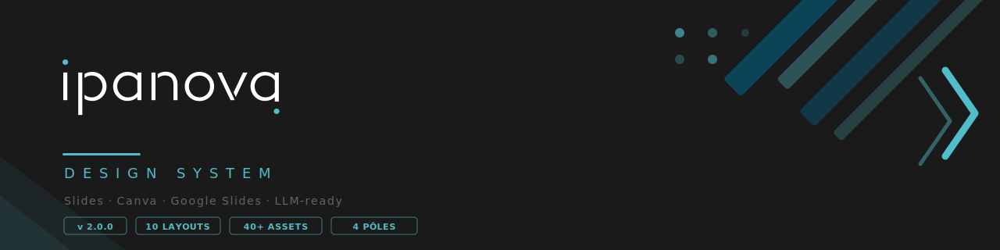
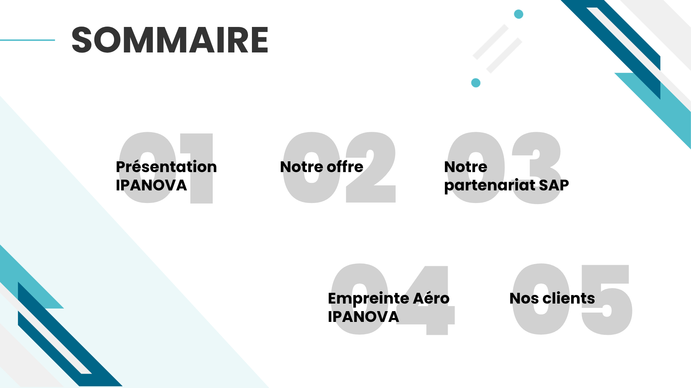
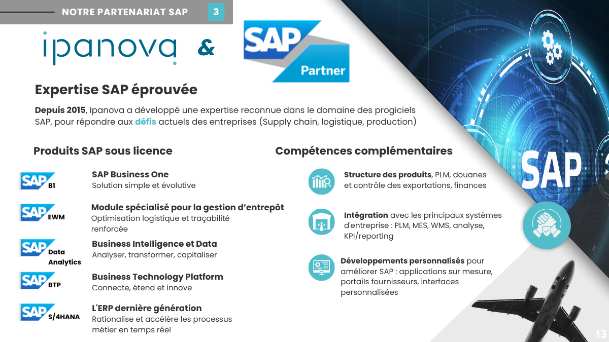
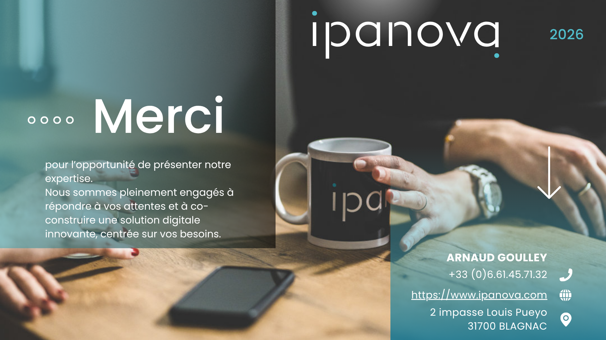

<div align="center">
  
</div>

<br/>

<div align="center">


</div>

<br/>

<div align="center">
<strong>Un système de design complet pour générer des slides Ipanova conformes à la charte,<br/>compatible Canva · Google Slides · PowerPoint · tout LLM.</strong>
</div>

---

## ★ Démarrage rapide

**Deux fichiers suffisent** pour générer des slides visuellement conformes ET factuellement justes :

| Fichier | Rôle |
|---|---|
| [`DESIGN.md`](DESIGN.md) | Tokens visuels · layouts · règles de composition |
| [`brand/ipanova.md`](brand/ipanova.md) | Faits · chiffres · équipe · 4 pôles · clients · messages |

```
1. Copie DESIGN.md + brand/ipanova.md dans le contexte de ton LLM
2. Fournis un brief (modèle → prompts/generation-brief.md)
3. Précise l'outil cible : Canva · Google Slides · PowerPoint · python-pptx
```

> `DESIGN.md` suit le standard [getdesign.md](https://getdesign.md/) — token, règle et rationale dans un seul fichier, lisible par un agent ou par un humain.

---

## Aperçu des slides

<table>
  <tr>
    <td width="33%"><br/><sub><b>Cover</b> — Titre + photo de fond</sub></td>
    <td width="33%"><br/><sub><b>Sommaire</b> — Ghost numbers + sections</sub></td>
    <td width="33%"><br/><sub><b>Section Divider</b> — Transition de section</sub></td>
  </tr>
  <tr>
    <td width="33%"><br/><sub><b>Content Split</b> — Photo + liste icônes</sub></td>
    <td width="33%"><br/><sub><b>Content Icon List</b> — Grille de services</sub></td>
    <td width="33%"><br/><sub><b>Process Timeline</b> — Phases horizontales</sub></td>
  </tr>
  <tr>
    <td width="33%"><br/><sub><b>Numbered Steps</b> — Méthodologie en étapes</sub></td>
    <td width="33%"><br/><sub><b>Partenariat SAP</b> — Co-branding + compétences</sub></td>
    <td width="33%"><br/><sub><b>Closing</b> — Slide de clôture + contact</sub></td>
  </tr>
</table>

---

## Les 4 pôles d'offre Ipanova

<table>
  <tr>
    <td align="center" width="25%">
      <br/><br/>
      <b>ERP / SAP</b><br/>
      <sub>S/4HANA · EWM · GTS · MES · SD<br/>MM · QM · PP · FICO · BI</sub>
    </td>
    <td align="center" width="25%">
      <br/><br/>
      <b>Data</b><br/>
      <sub>Business Intelligence<br/>Analytics · Reporting · KPI</sub>
    </td>
    <td align="center" width="25%">
      <br/><br/>
      <b>Applications sur mesure</b><br/>
      <sub>Développement web<br/>Intégrations · API · FIORI</sub>
    </td>
    <td align="center" width="25%">
      <br/><br/>
      <b>Intelligence Artificielle ✦</b><br/>
      <sub>Agents · RAG · Automatisation<br/>Fine-tuning · LLM on premise</sub>
    </td>
  </tr>
</table>

---

## Palette de couleurs

<table>
  <tr>
    <td align="center" width="16%">
      <br/>
      <b>Primary</b><br/><code>#51bdcb</code><br/>
      <sub>Teal — mots-clés,<br/>icônes, taglines</sub>
    </td>
    <td align="center" width="16%">
      <br/>
      <b>Secondary</b><br/><code>#006688</code><br/>
      <sub>Bleu foncé — logo,<br/>diagonales déco</sub>
    </td>
    <td align="center" width="16%">
      <br/>
      <b>Dark</b><br/><code>#333333</code><br/>
      <sub>Quasi-noir —<br/>tous les textes</sub>
    </td>
    <td align="center" width="16%">
      <br/>
      <b>Light</b><br/><code>#FAFAFA</code><br/>
      <sub>Blanc cassé —<br/>fond de slide</sub>
    </td>
    <td align="center" width="16%">
      <br/>
      <b>Banner</b><br/><code>#555555</code><br/>
      <sub>Gris moyen —<br/>bandeau section</sub>
    </td>
    <td align="center" width="16%">
      <br/>
      <b>Dark Panel</b><br/><code>#1a1a1a</code><br/>
      <sub>Noir profond —<br/>closing, covers</sub>
    </td>
  </tr>
</table>

---

## Typographie — Poppins uniquement

| Rôle | Graisse | Taille | Règle |
|---|---|---|---|
| Titre H1 slide | ExtraBold 800 | 36–48pt | UPPERCASE · mot-clé en `#51bdcb` |
| Titre section-divider | Black 900 | 56–72pt | UPPERCASE · bicolore |
| Ghost number | Black 900 | 200–280pt | `#51bdcb` à 8–12% opacité |
| Label icon-block | Bold 700 | 16–18pt | Sentence case |
| Corps de texte | Regular 400 | 13–15pt | 3 lignes max |
| Tagline italique | Bold Italic 700 | 13–15pt | `#51bdcb` · ≤ 8 mots |
| Bandeau section | Bold 700 | 12–14pt | UPPERCASE · letter-spacing 3px |

> **Règle absolue :** `MOT CLÉ` en teal · reste en dark · toujours UPPERCASE

---

## Les 10 layouts

| Layout | Usage | Structure |
|---|---|---|
| `cover` | Première slide | Photo plein fond + cadre centré + logo |
| `sommaire` | Plan du deck | Ghost numbers 01–05 en grille |
| `section-divider` | Transition de section | Grand numéro + titre + photos hexagonales |
| `content-split` | Photo + liste de points | 35% photo gauche / 65% icon-blocks droite |
| `content-icon-list` | Présentation de services | Grille 2×2 icon-blocks avec taglines |
| `content-map` | Présence ou process complexe | Carte / infographie pleine largeur |
| `process-timeline` | Phases d'un projet | 4 colonnes + chevrons teal |
| `numbered-steps` | Méthodologie | Grille 2×2 · ghost numbers · info boxes |
| `deliverables` | Livrables / fiche client | Infographie gauche + liste bordée droite |
| `closing` | Clôture + contact | 50/50 · panneau dark + photo |

---

## Assets disponibles

<details>
<summary><b>🎨 22 icônes teal outline</b></summary>
<br/>

| Catégorie | Icônes |
|---|---|
| Personnes & Organisation | `user` · `team` · `org-chart` · `team-cycle` · `team-victory` · `graduate` |
| Valeurs & Relation | `hand-heart` · `star-hand` · `high-five` · `chat` · `hands` |
| Technique & Digital | `gear-check` · `speedometer` · `puzzle` · `iot` · `innovation-cycle` |
| Logistique & Métier | `warehouse` · `clock` · `globe` |
| Recherche & Objectifs | `eye` · `search` · `target` |

→ [`images/INDEX.md`](images/INDEX.md)
</details>

<details>
<summary><b>📸 18 photos équipe authentiques</b></summary>
<br/>

| Sujet | Usage |
|---|---|
| `portrait-arnaud-neon.jpg` | Closing, présentation dirigeant |
| `team-meeting-3people-laptop.jpg` | Content-split gauche |
| `developer-woman-coding-screen.jpg` | Section développement / IA |
| `client-mission-airbus-india-team.jpg` | Références clients aéro |
| _+ 14 autres_ | → [`images/team-photos/INDEX.md`](images/team-photos/INDEX.md) |

</details>

<details>
<summary><b>🖼️ 16 slides de référence documentées</b></summary>
<br/>

Couvrent les pôles ERP/SAP, Data, Applications sur mesure, et le secteur Aéronautique.
→ [`examples/deck-reference/INDEX.md`](examples/deck-reference/INDEX.md)

> ⚠️ Slides dédiées au pôle **IA** à créer — non encore représentées dans les références.

</details>

---

## Structure du repo

```
ipanova-design-system/
├── DESIGN.md                    ★ Tokens visuels — injecter dans le LLM
├── brand/
│   └── ipanova.md               ★ Faits & contenu — injecter avec DESIGN.md
├── tokens/                      colors · typography · spacing
├── layouts/                     10 layouts documentés
├── components/                  8 composants (hexagone, banner, ghost-number…)
├── editorial/                   Ton de voix · interdits
├── prompts/                     system-prompt · generation-brief
├── images/
│   ├── INDEX.md
│   ├── icons/                   22 icônes teal outline
│   ├── graphical-elements/      3 éléments décoratifs signature
│   └── team-photos/             18 photos équipe + INDEX.md
└── examples/
    └── deck-reference/          16 slides documentées + INDEX.md
```

---

## Générer une slide

```
# Injecter dans ton LLM :
[contenu de DESIGN.md] + [contenu de brand/ipanova.md]

# Prompt exemple :
Génère une slide "content-icon-list" pour Ipanova.
Sujet : Notre offre IA
4 axes : Acculturation, Automatisation (n8n, Power Automate),
         Agents métier, Intégration ERP (SAP Joule)
Tagline teal pour chaque bloc.
Section banner : NOTRE OFFRE · Page 4
Outil cible : Google Slides
```

---

<div align="center">

**[ipanova.com](https://www.ipanova.com)**

Ipanova France — Toulouse · Nantes · Paris &nbsp;|&nbsp; Ipanova Inc — Mobile, Alabama (USA)

<sub>Design system extrait de 16 slides de référence · Maintenu par l'équipe Ipanova</sub>

</div>
